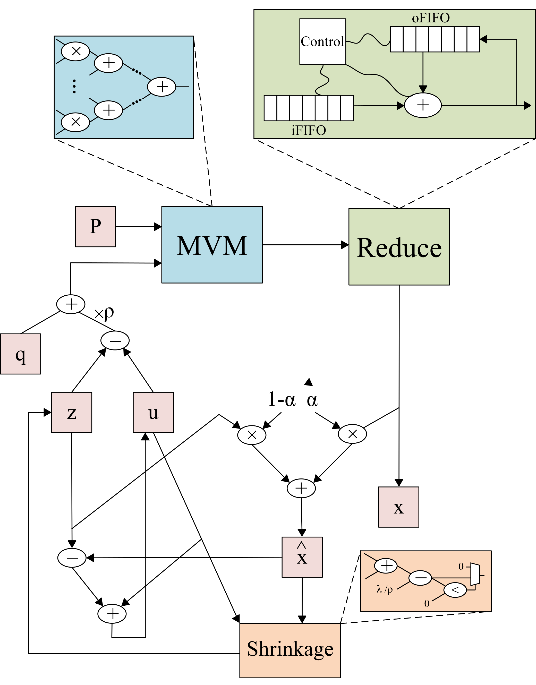

# FPGA-Accelerator
Implementation of Basis Pursuit algorithm based on ADMM. The steps to execute the algorithm are as follows:

1.1) x = P(z-u) + Q

1.2) x^ = alpha * x + (1 - alpha) * z

2) z = max(0, x^ + u - 1/rho) - max(0, -x^ - u - 1/rho)

3) u = u + (x^ - z)

## Hardware Architecture

  

